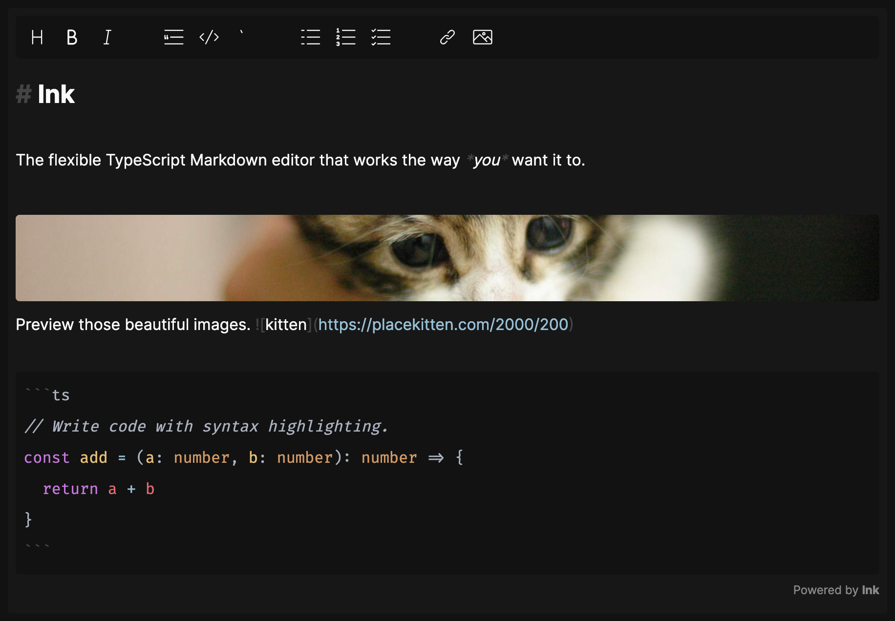

[](https://github.com/voraciousdev/ink-mde/releases)
[](https://github.com/voraciousdev/ink-mde/blob/master/LICENSE)
[](https://github.com/voraciousdev/ink-mde/issues)

# ink-mde/vue

The flexible TypeScript Markdown editor that powers [octo.app](https://octo.app) - packaged as a Vue 3 component. You can also check out the framework-agnostic package at [voraciousdev/ink-mde](https://github.com/voraciousdev/ink-mde).



## Features

- [x] Dark and light themes
- [x] Hybrid plain-text Markdown rendering
- [x] Supports GitHub Flavored Markdown ([an extension of CommonMark](https://github.github.com/gfm/#what-is-github-flavored-markdown-))
- [x] Syntax highlighting for many common languages (in code blocks)
- [x] Drag-and-drop or paste to upload files
- [x] Inline Markdown image previews
- [x] Configurable and stylable
- [x] An optional formatting toolbar (great for mobile)
- [x] Vim Mode

## Install the package

```bash
# yarn
yarn add ink-mde

# npm
npm install --save ink-mde
```

## How to get started

There are many ways to customize Ink to fit your needs. Here are a few examples to get you started.

### Minimal setup

```vue
<template>
  <Ink v-model="markdown" />
</template>

<script lang="ts" setup>
import Ink from 'ink-mde/vue'
import { ref } from 'vue'

const markdown = ref('# Hello, World!')
</script>
```

### Configuration options

The `options` prop is an [`Ink.Options`](https://github.com/voraciousdev/ink-mde) object.

```vue
<template>
  <input v-model="options.interface.appearance" type="radio" value="dark"> dark
  <input v-model="options.interface.appearance" type="radio" value="light"> light
  <Ink v-model="markdown" :options="options" />
</template>

<script lang="ts" setup>
import Ink from 'ink-mde/vue'
import { reactive, ref } from 'vue'

const markdown = ref('# Hello, World!')
const options = reactive({
  interface: {
    appearance: 'dark',
  },
})
</script>
```

## Contributing

This library uses `yarn`.

### Install dependencies

```shell
yarn install
```

### Compile and hot-reload for development

```shell
yarn dev
```

### Compile for production

```shell
yarn build
```

## Support

Your support is appreciated. Here are some ways you can help. ♥️

### Tell us what you think

Your feedback is immensely important for building Ink into a library that we all love. Consider [starting a discussion](https://github.com/voraciousdev/octo/discussions) under [Octo](https://github.com/voraciousdev/octo) if you have a question or just want to chat about ideas!

### Become a financial backer

- [GitHub Sponsors](https://github.com/sponsors/voraciousdev)
- [Patreon](https://patreon.com/voraciousdev)
- [Ko-Fi](https://ko-fi.com/voraciousdev)
- [Buy Me a Coffee](https://www.buymeacoffee.com/voraciousdev)
